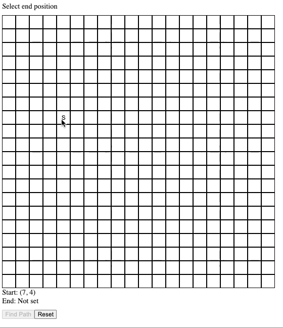

# Full Stack DFS Visualizer - Go, React

## Instructions to run locally

For the server,

- `cd backend`
- `go get`
- `go run main.go`

For the client,

- `cd frontend/dfs_visualizer`
- `npm install`
- `npm start`

Navigate to `http://localhost:5173/` to interact with the grid matrix and observe the shortest path between the start and the end points.

